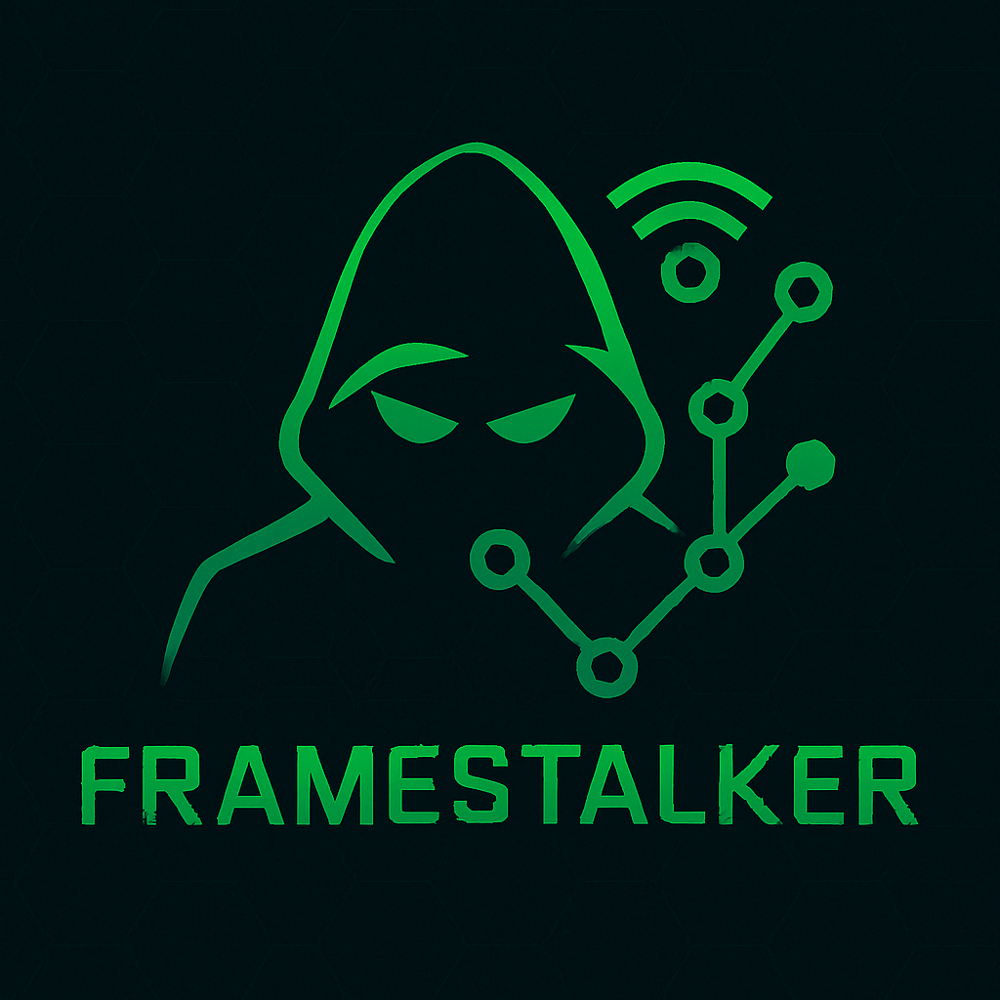

<p align="center">
  
</p>

# FrameStalker

FrameStalker is a modular Wi-Fi frame sniffer and deauthentication tool with a user-friendly GUI, built for security researchers and wireless network enthusiasts. Designed in Python with PyQt5 and Scapy, it provides passive monitoring and active attack capabilities for beacon frames, STAs, and deauth traffic.

---

## Disclaimer

FrameStalker is intended **only for educational use and authorized penetration testing**.
Unauthorized use against networks you do not own or have permission to assess is **illegal** and **punishable by law**.

> This tool requires:
>
> * Root privileges (e.g., via `sudo`)
> * A wireless adapter that supports monitor mode

---

## Features

*  **Beacon Sniffer** – Capture and analyze Wi-Fi beacon frames
*  **STA Sniffer** – Detect stations probing or connecting to APs
*  **Passive Deauth Sniffer** – Monitor deauthentication attacks on the network
*  **Active Deauth Attacker** – Target devices with controlled deauthentication bursts
*  **Vendor Lookup** – Offline MAC vendor resolution via IEEE OUI
*  **Live GUI Logs** – Color-coded real-time logging panel

---

## Requirements

* Python 3.8+
* Linux (tested on Kali and Linux Mint)
* **Monitor-mode capable wireless card** (e.g. Alfa AWUS036ACH)
* Root/sudo access

---

## Instructions

### Install Dependencies

```bash
pip install PyQt5 scapy
```

### Download Manually

1. [Download the ZIP](https://github.com/ipapidi/FrameStalker/archive/refs/heads/main.zip)
2. Extract the contents

### Clone with Git 

```bash
git clone https://github.com/ipapidi/FrameStalker.git
cd FrameStalker
```

### Setup Steps

1. Open a terminal inside the project folder.

2. Make the bash files executable (if needed):

   ```bash
   chmod +x install.sh
   chmod +x launch.sh
   ```

3. Run the installer:

   ```bash
   ./install.sh
   ```
---

### Running the Application

#### CLI Mode:

```bash
./launch.sh
```

#### GUI Mode:

```bash
./launch.sh --gui
```

Or run the installed application from menu or desktop.

---

### Considerations

1. A Wi-Fi adapter with **monitor mode** support is **required**.
2. If the **passive deauth sniffer** shows no output, try running an **active deauth attack** in a separate terminal window.
3. You **must select a folder** to save PCAP files before starting any **deauth** sniffer (passive or active).
4. Always click the **"Stop" button** in the GUI before switching tools.
5. If the project folder was moved, delete `.pyc` cache files from `sniffers/` and `ui/` folders to avoid errors:

   ```bash
   sudo find sniffers/ ui/ -name '__pycache__' -type d -exec rm -r {} +
   ```
6. Tested with **Python 3.13.2**
7. All tools/scripts should be run with **root privileges** (i.e. using `sudo`).

---

## Alternative Manual Use (Not Default)

>  This method is **not fully implemented**. Use `launch.sh` or the installed app for the full experience.

### Beacon & STA Sniffers

```bash
python3 beacon_sniffer.py wlan0
python3 sta_sniffer.py wlan0
```

### Deauth Sniffer Modes

#### Passive:

```bash
python3 deauth_sniffer.py passive wlan0 /path/to/save/file.pcap
```

#### Active:

```bash
python3 deauth_sniffer.py active wlan0 APMAC STAMAC channel count /path/to/save/file.pcap
```

* `count` = number of deauth packets (or `0` for infinite)

#### Interactive Mode:

```bash
python3 deauth_sniffer.py
```

This launches an interactive prompt to choose between modes.

---

## Project Structure

```
FrameStalker/
├── sniffers/              # Beacon, STA, and Deauth sniffing modules
├── ui/                    # GUI code and logging
├── logs/                  # Captured PCAPs and logs
├── assets/                # Icon and screenshots
├── launch.sh              # Launcher script
├── frame_stalker_gui.py   # Main GUI entry point
├── install.sh             # Installer
└── .gitignore
```

---

## License

MIT License – see [LICENSE](LICENSE) for details.

---

## Authors 

* **Ioli Papidi** — [@ipapidi](https://github.com/ipapidi)
* **Foteini A. Alexopoulou** — [@F-A-Alex](https://github.com/F-A-Alex)
